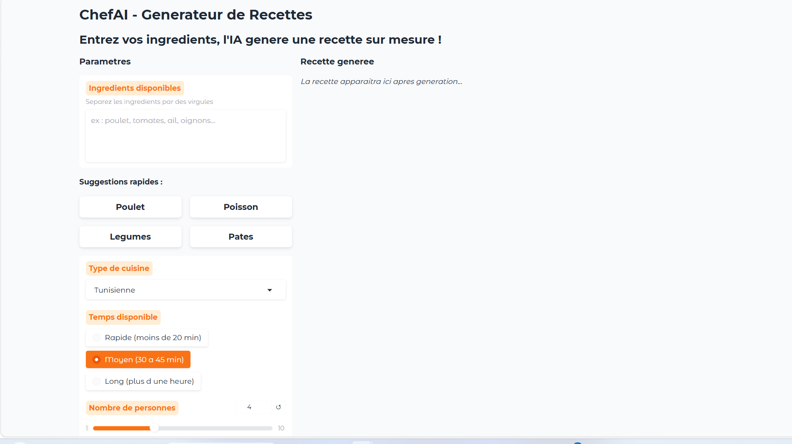
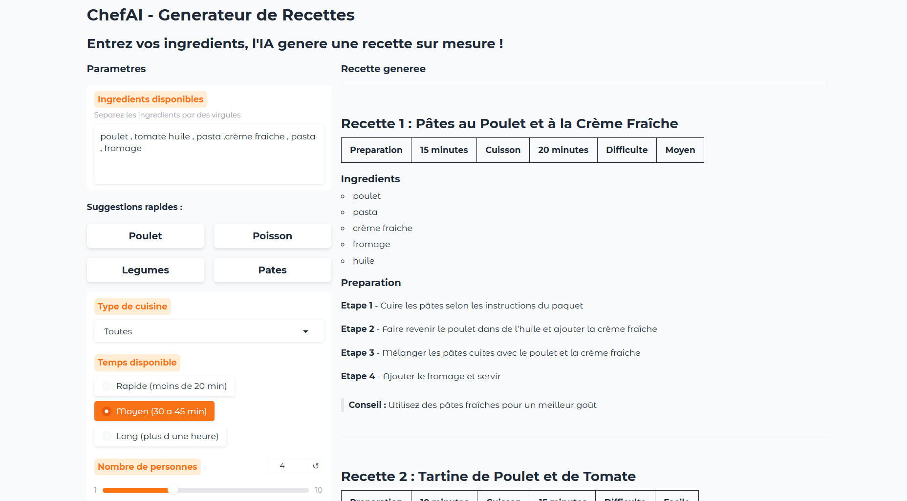
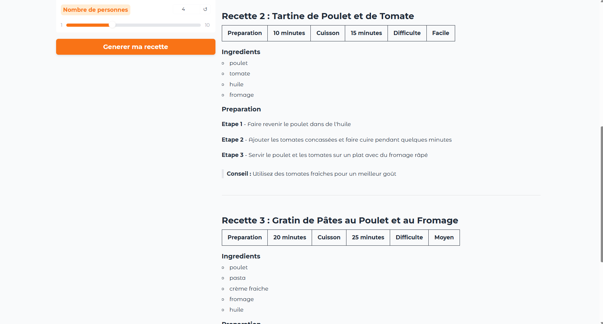
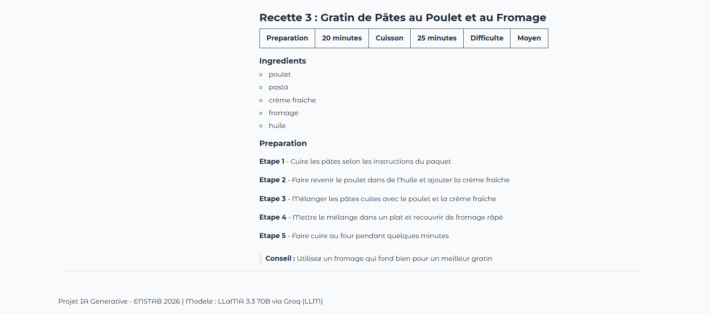
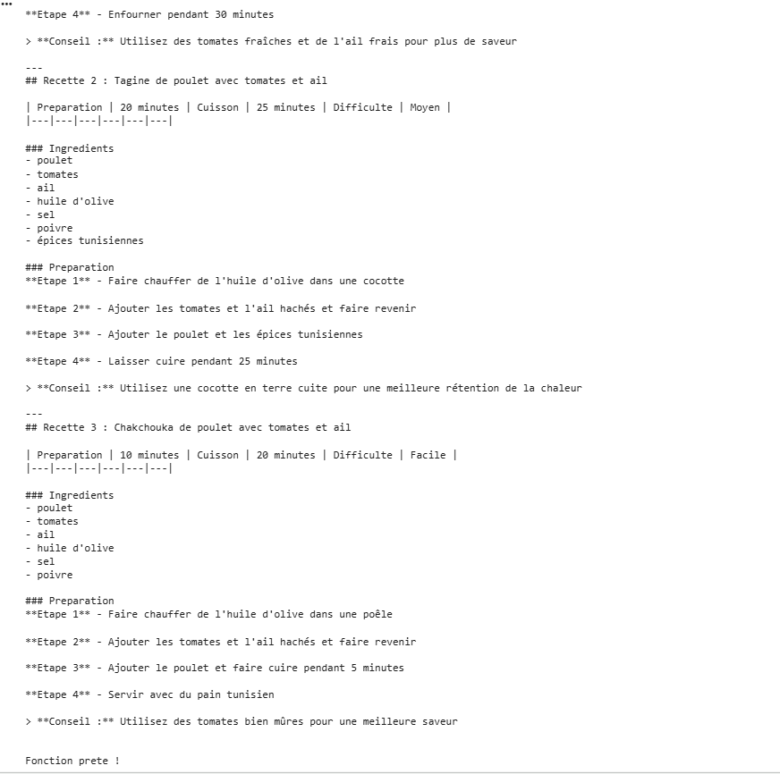

# ChefAI - Generateur de Recettes avec IA Generative

## Description
Application web qui genere 3 recettes de cuisine a partir des ingredients disponibles grace a l'IA generative.

## Modele utilise
LLaMA 3.3 70B via Groq API (LLM - Large Language Model)

## Fonctionnalites
- Entrer ses ingredients disponibles
- Choisir le type de cuisine (Tunisienne, Francaise, Italienne...)
- Choisir le temps de preparation
- Generer 3 recettes automatiquement
- Interface web interactive avec Gradio

## Technologies
- Python
- Groq API (LLaMA 3.3 70B)
- Gradio
- Google Colab

## Comment lancer le projet
1. Ouvrir le fichier ChefAI_Groq.ipynb dans Google Colab
2. Obtenir une cle API gratuite sur https://console.groq.com
3. Coller la cle dans la cellule 3
4. Executer toutes les cellules
5. Cliquer sur le lien gradio.live qui apparait
## Captures d'ecran

### Interface principale

### Recette 1

### Recette 2

### Recette 3

### Resultat test Colab

## Etudiante
- Nom : Yasmine Benachour
- Filiere : [2éme TA SIC ]
- Annee : 2025-2026

## Projet academique
ENSTAB 2026 - Cours IA Generative - Prof. Amira Echtioui
